# Lab Report 1

## Topic: Remote Access
 

### Installing VSCode
VSCode is a popular text editor / IDE. 
 
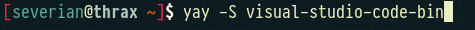
 
*How I installed VSCode (using pacman package manager).*
 
 
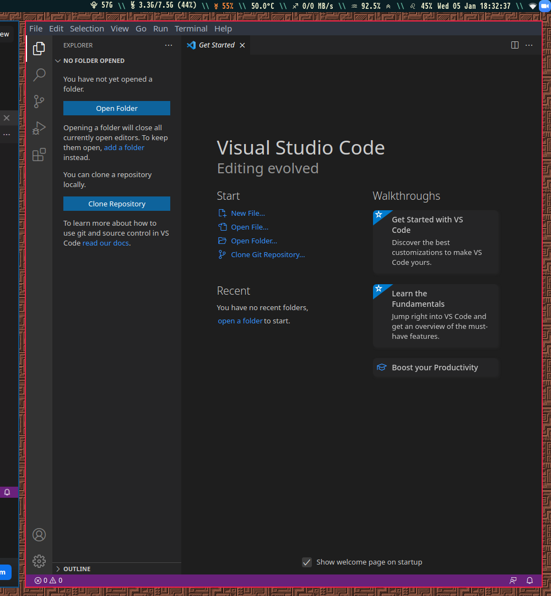
 
*A screenshot of VSCode after installation.*
 
 

### Remotely Connecting
We will be using SSH to open a remote shell on one of UCSD's servers.
 
 
Command: `ssh cs15lwi22***@ieng6.ucsd.edu`
 
*The asterisks should be replaced with the letters specific to the username attached to your UCSD student account.*
 
 
After running this commmand you will be prompted to enter a password.
 
 
This is what your terminal should look like after successfully logging in.
 
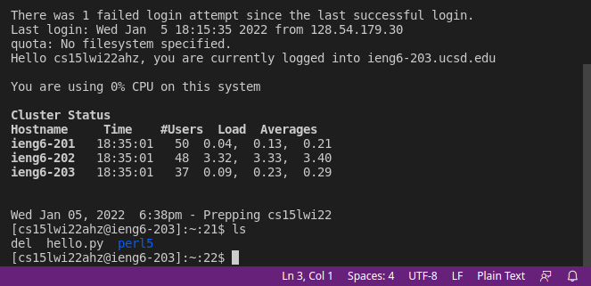
 
 

### Trying Some Commands
There are a number of useful commands you can run in the shell.
 
 
For example:
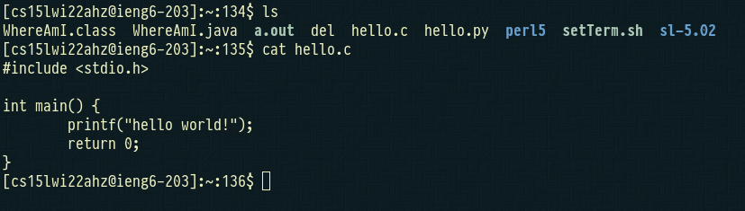
 
*Here I run the 'ls' command to output all of the files and directories in my home directory followed by the 'cat' command to output the contents of the 'hello.c' file.*
 
 
Another example:
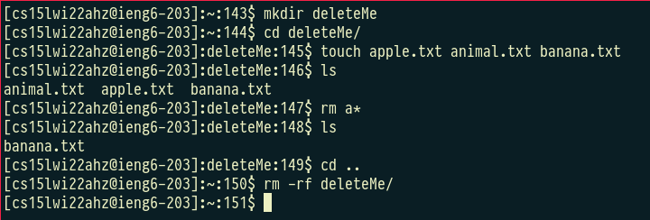
 
*Here I run the 'mkdir' command to create a new directory. I use 'cd' to move into that directory. I then use the 'touch' command to create three text files. Next I use the 'rm' command to delete all files in the directory that start with the letter 'a'. I 'cd' back into my home directory and use 'rm' with the '-rf' flags to delete the directory I created at the beginning.*
 
 

### Moving Files with scp
We can use the 'scp' command to copy files/directories over SSH from our local machine to a remote server and vice versa. 
 
 
Normally you will be prompted to type your password after running the command. This is not shown in my screenshots because I have added my local machine's public SSH key to the server's authorized keys. This will be shown in the next step.
 
 
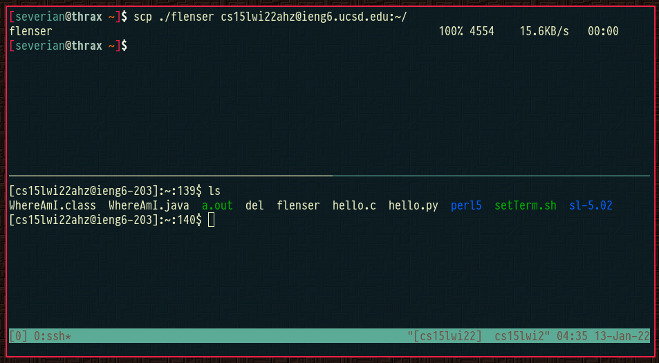
 
*Copying a file from my local machine to the remote server's home directory.*
 
 
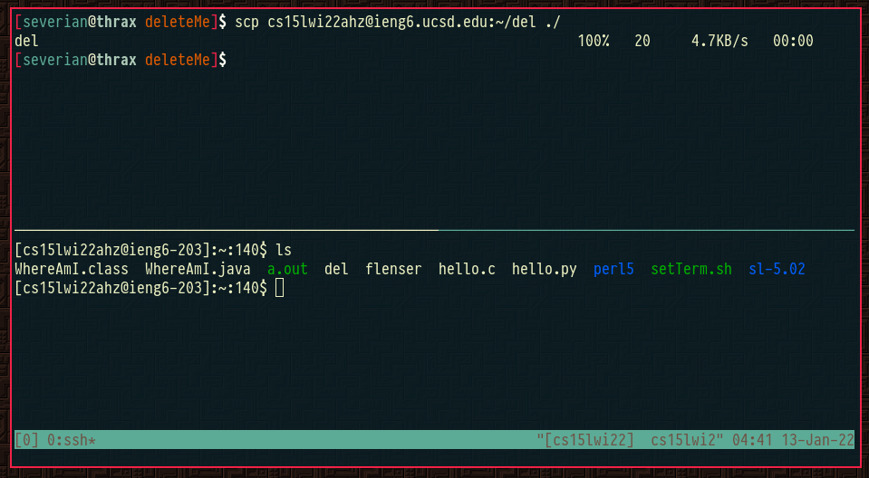
 
*Copying a file from the remote server's home directory to a directory on my local machine.*
 
 

### Setting an SSH Key
It can be tedious to type out your password every time we interact with the server over SSH. By setting a public/private SSH key pair on our local machine and adding our public key to the server's list of authorized keys we can avoid this.
 
 
We can create a public/private SSH key pair on our local machine using the 'ssh-keygen' command. Make sure to enter nothing for the password if your goal is to be able to log in without using a password.
 
 
Running the command will generate new files in the .ssh directory on your local machine (id_rsa and id_rsa.pub).
 
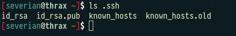
 
 
Using 'scp', copy 'id_rsa.pub' to the file '~/.ssh/authorized_keys' on the remote server.
 
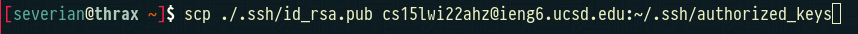
 
 
Now you should be able to log into the remote server without typing in a password.
 
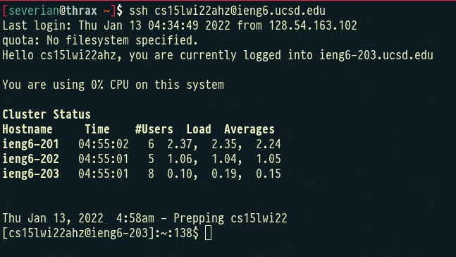
 
 
### Optimizing Remote Operations
We can add a bash command in quotes after the ssh command to run that command on the remote server without logging into the shell. 
 
 
Here is an example:
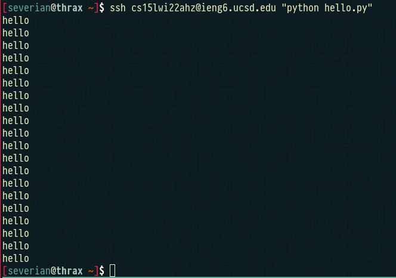
 
 
In bash, semicolons can be used to run multiple commands in sequence. 
 
 
Here is an example:
 
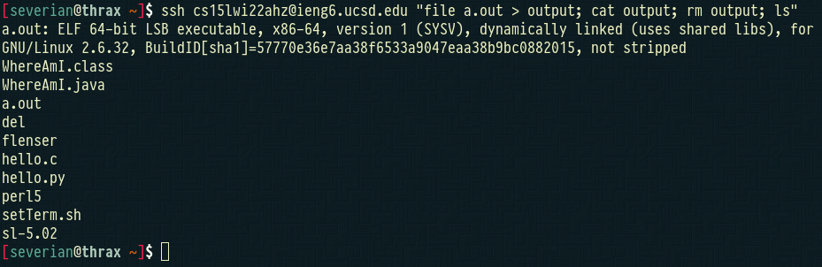
 
 
It doesn't take much imagination to think about how these two techniques can greatly optimize our workflow.
For example, if you had to run the same set of commands over and over again you can reduce the keystrokes for each iteration to two (up arrow to bring up the command, enter to run it).
 
 

### What we did in Lab 1: 
- Installed a popular text editor / IDE
- Learned how to connect to a remote server using SSH
- Learned some basic bash commands
- Learned how to copy files over SSH
- Learned a few ways to optimize our SSH workflow
 
[Home](/index.html)
