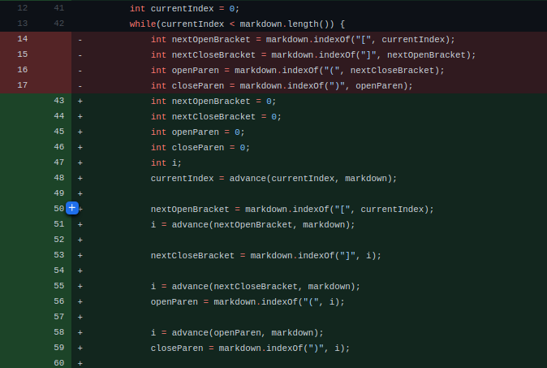

# Lab Report 2

## Topic: Debugging

<br>

### Our Program
*Our program's goal was to take in a markdown file as input and output the URLs of all links within that file.*
<br>
<br>

## **Bug Fix 1**
___
*This bug was found on the original MarkdownParse file that was provided by the professor.*

### Failure-Inducing Input
This is the test file that caused a failure in our program.
<br>
<br>

<br>
[https://github.com/JessalynWang/markdown-parse/blob/main/Group-test-file4.md?plain=1](https://github.com/JessalynWang/markdown-parse/blob/main/Group-test-file4.md?plain=1)
<br>
<br>
The problem was that our program was getting stuck in an infinite loop.
<br>
<br>

### The Symptom
After inserting a print statement in the loop it was clear that the while loop within the getLinks function never exits.
<br>
<br>
`bash java MarkdownParse test-file4.md`
<br>

<br>

### The Bug
The problem was that Java's 'indexOf' method returns -1 if the substring is not found. The end condition of the while loop is `currentIndex < markdown.length()`, and the 
the way that `currentIndex` is incremented is by adding it to the index of last found 
closing parentheses. However, if a closing parentheses was never found, the index that
is added to `currentIndex` would be -1. This would result in the end condition of
the while loop never being met because currentIndex would never read the value needed
to exit.

### The Fix

This was the change we made.

This will break the loop if we detect that there are no more starting brackets in the 
rest of the file, which would indicate that there are no more links to extract.

<br>

### In conclusion:
- We first noticed a *symptom* in the output of our program -> our program was getting stuck in an infinite loop. 
- The failure-inducing input was the only test file that did not end with a link; it had characters that trailed the end of the last link in the file.
- We walked through the logic of our program to determine the *bug* that was causing our symptom. We saw that when a file had more characters after its final link it would
prevent the exit condition of our while loop from ever being met.
- We added a break condition in the loop that would execute if we could tell that there were no more links to be found in the rest of the file. This prevented the infinite loop from happening and the program began behaving as expected. 

## **Bug Fix 2**
___
*This bug was found on the original MarkdownParse file that was provided by the professor.*

### Failure-Inducing Input
This is the test file that caused a failure in our program.
<br>
<br>

<br>
[https://github.com/Ricefrog/markdown-parse-week3/blob/main/test-file4.md?plain=1](https://github.com/Ricefrog/markdown-parse-week3/blob/main/test-file4.md?plain=1)
<br>
<br>
The problem was that our program was not ignoring the characters that are escaped 
using a backslash and therefore was incorrectly extracting links when backslashes were involved.
<br>
<br>

### The Symptom

This was the terminal output after running the program on the failing test file:
<br>
`[https://something.com, some-page.html, \]`
<br>
<br>
The correct output should look like this:
<br>
`[https://something.com, some-page.html, this is a link]`
<br>
<br>

### The Bug
The problem was that there was nothing in our program that told it ignore brackets and
parentheses that had a backslash immediately before them. It was considering invalid links.

### The Fix

These are the relevant changes we made.


<br>
We created two helper functions for dealing with backslashes. The first, `isEscaped`, 
just checks if the character immediately before the character at the current index is
a backslash. The second, `advance`, will advance the current index by 2 until it
reaches a character that is not escaped. It will then return that index. Within 
the while loop of `getLinks` we use the `advance` function after each bracket/
parentheses is found to move the index past the escaped characters we want to ignore. 
This solution worked, and our program was able to ignore escaped characters when it 
looked for links.

<br>

### In conclusion:
- We first noticed a *symptom* in the output of our program -> our program was not ignoring escaped characters. 
- By looking at our program we could easily see that it treated all characters the same; we needed to make it behave differently for escaped characters.
- After adding some helper functions for ignoring escaped characters our program worked as expected and the bug was fixed.


## **Bug Fix 3**
___
*This bug was found on a version of the program where we had moved to a stack-based parsing algorithm.*
<br>

### Failure-Inducing Input
This is the test file that caused a failure in our program. At this point we had moved onto a stack-based parser. This parser was able to pass all tests except one.
<br>
<br>

<br>
[https://github.com/JessalynWang/markdown-parse/blob/main/test-file6.md](https://github.com/JessalynWang/markdown-parse/blob/main/test-file6.md)
<br>
<br>
The problem was that our program was including the URLs/sources of images, when the expected behavior was for images to be ignored, as they are not links. 
<br>
<br>

### The Symptom
```
java MarkdownParse.java test-file.md
[https://something.com, some-page.html]
java MarkdownParse.java test-file2.md
[https://something.com, some-page.html, https://something.com, some-page.html]
java MarkdownParse.java test-file3.md
[]
java MarkdownParse.java test-file4.md
[]
java MarkdownParse.java test-file4.md
[]
java MarkdownParse.java test-file5.md
[]
java MarkdownParse.java test-file6.md
[page.com]
java MarkdownParse.java test-file7.md
[]
java MarkdownParse.java test-file8.md
[a link on the first line]
```
All of these outputs are correct, except for when the program is run on test-file6.md. The output includes 'page.com', which is a URL for an image. Because we expected the output to be an empty list, this was a sign that showed us that our program had a bug.

<br>
<br>

### The Bug
Our program used a stack to iterate through the characters in a file and add URLs to a list of strings if a certain pattern was found.
This pattern was `[placeholder](URL)`, where 'placeholder' and 'URL' are arbitrary strings. 
The cause of our bug lay in the fact that the format for images in markdown is 
``, which is a superset of the 'link' patterns that our program was looking for. 
Because the format of images fit the pattern we were searching for, the program included the URLs/sources of images in its output.
<br>
<br>

### The Fix
These are the changes we made:
<br>

<br>
The key change is in lines 54-55. We added a condition where if the current character 
is an exclamation mark, we are not at the end of the file, and the next character is 
a right-bracket we increment the current index by two and move onto the next iteration
of the loop. This will invalidate sequences that start with `![` from being considered
as potential patterns for links in our program.

<br>

### In conclusion:
- We first noticed a *symptom* in the output of our program -> our program was incorrectly treating images as links. 
- The failure-inducing input was the only test file that contained an image. It was also the only test file that did result in a correct output.
- We walked through the logic of our program to determine the *bug* that was causing our symptom. It was due to the fact that we had no checks in place to make sure that we ignored patterns in the file that indicated images, which have similar patterns to links in markdown.

<br>
[Home](/index.html)
