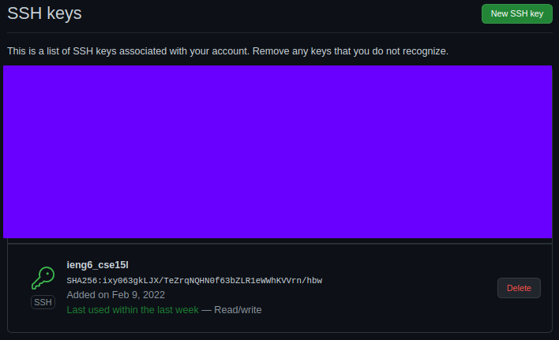
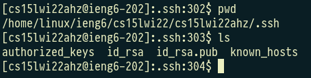
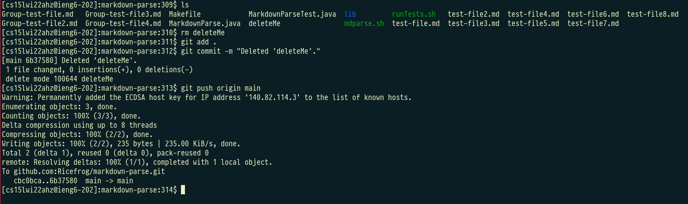

# Lab Report 2

## Topic: Syncing Across Different Machines (Github Access from Remote Server)

In this course every student was given access to an account on a UCSD pi-cluster they could SSH into. This server will be referred to henceforth as 'ieng6'. 

Show where the public key you made is stored on Github and in your user account (screenshot)
Show where the private key you made is stored on your user account (but not its contents) as a screenshot
Show running git commands to commit and push a change to Github while logged into your ieng6 account
Show a link for the resulting commit

 
 

### __Adding ieng6's Public RSA to my Github Account__

To be able to access Github from my ieng6 box I needed to add its public RSA key to my Github account's list of trusted keys.

*This is what it looks like after adding ieng6's public RSA key to my Github account's list of authorized keys.*

 
 

*This is where the ieng6 box stores its public RSA key. It is on the 'id_rsa.pub' file.*

 
 

### __Where is the Private Key Stored?__

 

*This is where the ieng6 box stores its private RSA key as well. It is in the 'id_rsa' file.*

 
 

### __Pushing to a Repo from ieng6__

 

*Here you can see me making a commit to my markdown-parse repo through the ieng6 box.*

 

Link to commit: [https://github.com/Ricefrog/markdown-parse/commit/6b37580321e776687e76e3c064f45c08b5d3556c](https://github.com/Ricefrog/markdown-parse/commit/6b37580321e776687e76e3c064f45c08b5d3556c)

 

[Home](/index.html)